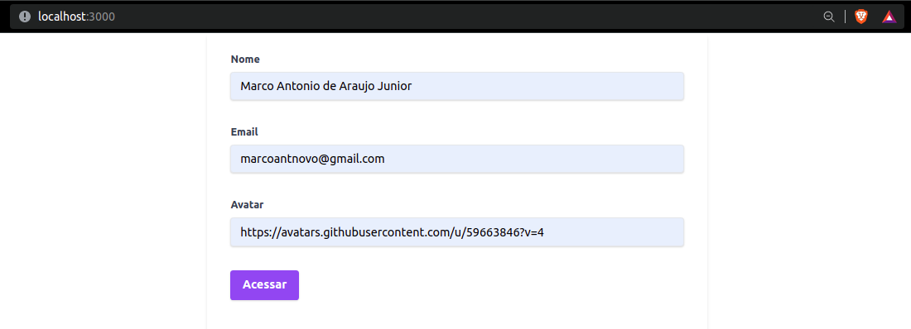
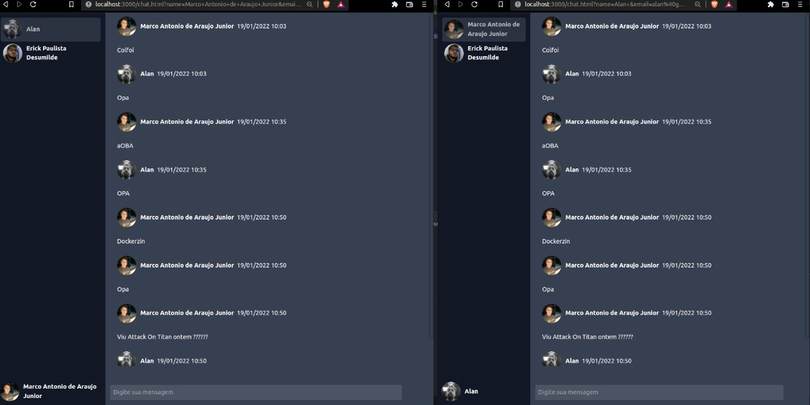

## Técnologias / Bibliotecas utilizadas 
 - MongoDB
 - Docker 
 - Typeorm 
 - Express 
 - Tsyringe
 - NodeJs
 - Socket.io 

#

 ## Iniciando o projeto 
 Primeiro crie a imagem do mongodb
 > docker run --name mongodb -p 27017:27017 -d -t mongo

 #
Agora instale todas as depedências
 > **Instalações:**  npm install 

#
Inicie o projeto: 
 > npm run dev 

#
Servidor iniciará na porta 3000.
#

Acesse a rota no frontend para criar seu chat

#

Após fazer o login vai ser redirecionado para tela de chats 
